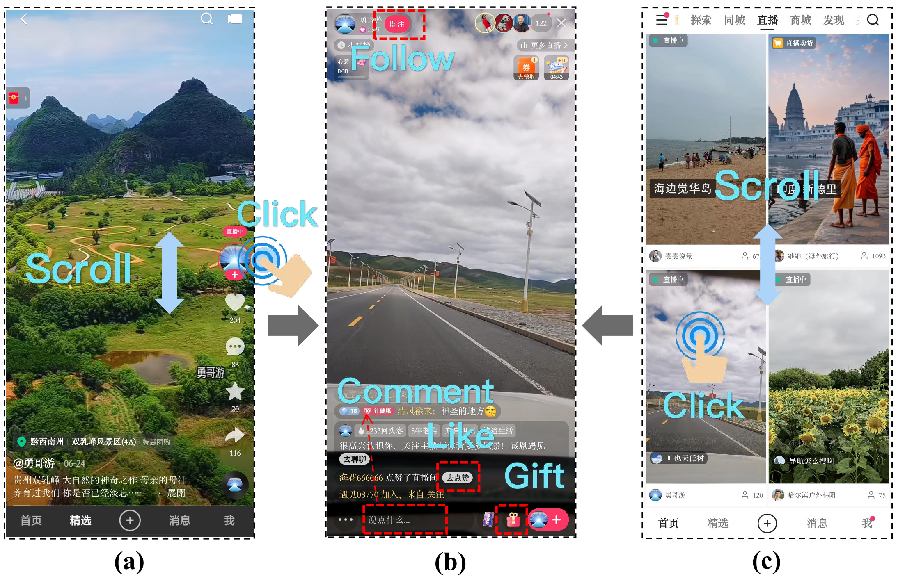

# KuaiLive

*KuaiLive* is a large-scale real-world dataset for live streaming recommendation collected from [Kuaishou](https://www.kuaishou.com/en), a leading live streaming platform in China with over 400 million daily active users. Notably, revenue from live streaming contributes approximately 30% of the company’s total income, highlighting its significant commercial potential.

**This is the first publicly available live streaming dataset that captures rich and realistic sequences of user interactions within an interactive app environment.**


## Overview

On Kuaishou, users can discover and enter live rooms of interest, where they interact with streamers in real time through behaviors such as clicking, liking, commenting, following, and sending virtual gifts. 



<p style="font-size:15px; text-align:left;">Figure: Illustration of live streaming scenarios in Kuaishou App. 
(a) The single-column recommendation feed, where users scroll vertically to receive a mix of short videos and live streams. 
(b) The live streaming interface, where users can interact with the streamer through actions such as Follow, Comment, Like, and Gift. 
(c) The two-column live streaming recommendation interface, where users scroll to browse live streams and click a thumbnail to enter a live room.</p>

## Download the data:


KuaiLive has been shared at [https://zenodo.org/records/16565801](https://zenodo.org/records/16565801).

[](https://doi.org/10.5281/zenodo.16565801)

OPTION 1. Download via your browser:

You can download the dataset from this [link](https://zenodo.org/records/16565801).

OPTION 2: Download via the 'wget' command tool:

For the KuaiLive dataset:

```bash
wget https://zenodo.org/record/16565801/files/KuaiLive.zip
unzip KuaiLive.zip
```


## Citation

If you find our dataset useful, please cite the paper:

```BibTex
@article{qu2025kuailive,
  title={KuaiLive: A Real-time Interactive Dataset for Live Streaming Recommendation},
  author={Qu, Changle and Dai, Sunhao and Guo, Ke and Zhao, Liqin and Niu, Yanan and Zhang, Xiao and Xu, Jun},
  journal={arXiv preprint arXiv:2508.05633},
  year={2025}
}
```

## License

[![CC BY-NC-SA 4.0][cc-by-nc-sa-shield]][cc-by-nc-sa]

This work is licensed under a
[Creative Commons Attribution-NonCommercial-ShareAlike 4.0 International License][cc-by-nc-sa].

[![CC BY-NC-SA 4.0][cc-by-nc-sa-image]][cc-by-nc-sa]

[cc-by-nc-sa]: http://creativecommons.org/licenses/by-nc-sa/4.0/
[cc-by-nc-sa-image]: https://licensebuttons.net/l/by-nc-sa/4.0/88x31.png
[cc-by-nc-sa-shield]: https://img.shields.io/badge/License-CC%20BY--NC--SA%204.0-lightgrey.svg

## Contact

If you have any questions, please feel free to contact us through [github issues](https://github.com/imgkkk574/KuaiLive/issues)
