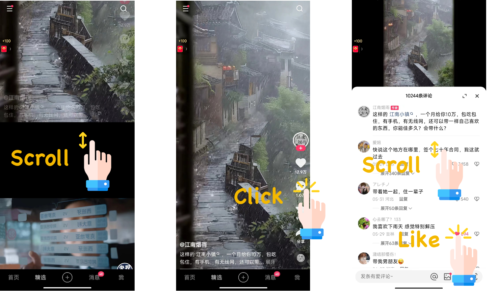

# KuaiLive

*KuaiLive* is a large-scale real-world dataset for live streaming recommendation collected from Kuaishou, a leading live streaming platform in China with over 400 million daily active users. 

**This is the first publicly available live streaming dataset that captures rich and realistic sequences of user interactions within an interactive app environment.**

## Overview

On Kuaishou, users can discover and enter live rooms of interest, where they interact with streamers in real time through behaviors such as clicking, liking, commenting, following, and sending virtual gifts. 

### Advantages:

Compared with other existing datasets, KuaiLive has the following advantages:

- ✅ It includes the start and end times of each live room, allowing researchers to simulate realistic recommendation settings where candidate items are temporally constrained and dynamically changing.
- ✅ It records multiple user behaviors (click, comment, like, gift), which can be leveraged to study multi-task learning and behavior modeling.
- ✅ It preserves the temporal order of each interaction, supporting fine-grained analysis of user behavior trajectories.
- ✅ It contains not only positive feedback but also negative feedback, making it suitable for Click-Through Rate (CTR) prediction.
- ✅ It provides not only user and item IDs, but also rich side information features, facilitating feature-aware modeling.
- ✅ It includes user watch time and gift price, enabling broader research tasks beyond recommendation, such as watch time and gift price prediction.

### Statistics

Here we show some basic statistics.
Check this page for more detailed [Descriptions](./detailed_statistics.html).

KuaiComt contains the real behavior of 34,701 users on the Kuaishou app from September 30, 2023, to November 3, 2023. Due to the large number of comment impressions to users, we only provide data on user interactions with comments (likes and replies). Videos with fewer than 55 comments and comments with fewer than 2 interactions were filtered out. Additionally, video titles and comment texts were anonymized.

Basic statistics of this dataset in the are summarized as follows:

**KuaiLive**

| Property           | LiveRec      | LSEC     | Klive    | KuaiLive                |
|:------------------:|:------------:|:--------:|:--------:|:-----------------------:|
| # Users            | 15,500,000   | 202,850  | -        | 23,772                  |
| # Streamers        | 465,000      | 7,395    | 9,932    | 452,621                 |
| # Rooms            | ?            | -        | 17,798   | 11,613,708              |
| # Interactions     | 124,000,000  | 5,439,288| -        | 5,357,998               |
| Lifecycle          | ❌           | ❌       | ❌       | ✅                      |
| Side info features | ❌           | ❌       | ❌       | ✅                      |
| Action type        | click        | follow   | -        | click+comment+like+gift |

| Dataset   | #Users  | #Streamers |  #Rooms    | #Interactions | #Clicks   | #Comments | #Likes   | #Gifts   |
|:---------:|:-------:|:----------:|:----------:|:-------------:|:---------:|:---------:|:--------:|:--------:|
| ourdata   | 23,772  | 452,621    | 11,613,708 | 5,357,998     | 4,909,515 | 196,526   | 179,311  | 72,646   |

| Feature Type       | Feature Descriptions |
|:------------------:|:--------------------:|
| **User feature**   | gender, age, country, device_brand, device_price, reg_timestamp, fans_num, follow_num,   first_watch_live_timestamp, accu_watch_live_cnt, accu_watch_live_duration, is_live_author, is_video_author,   and 7 encrypted vectors. |
| **Streamer feature** | gender, age, country, device_brand, device_price, reg_timestamp, live_operation_tag, fans_num, fans_group_num,   follow_num, first_live_timestamp, accu_live_cnt, accu_live_duration, accu_play_cnt, accu_play_duration,   and 7 encrypted vectors. |
| **Room feature**   | start_timestamp, end_timestamp, live_type, live_content_category, and live_name_representation. |

## Download the data:

KuaiLive has been shared at ... 
<!-- [https://zenodo.org/records/13922581](https://zenodo.org/records/13922581). -->

## Citation

If you find our dataset useful, please cite the paper:

[![CC BY-NC-SA 4.0][cc-by-nc-sa-shield]][cc-by-nc-sa]

This work is licensed under a
[Creative Commons Attribution-NonCommercial-ShareAlike 4.0 International License][cc-by-nc-sa].

[![CC BY-NC-SA 4.0][cc-by-nc-sa-image]][cc-by-nc-sa]

[cc-by-nc-sa]: http://creativecommons.org/licenses/by-nc-sa/4.0/
[cc-by-nc-sa-image]: https://licensebuttons.net/l/by-nc-sa/4.0/88x31.png
[cc-by-nc-sa-shield]: https://img.shields.io/badge/License-CC%20BY--NC--SA%204.0-lightgrey.svg

## Contact

