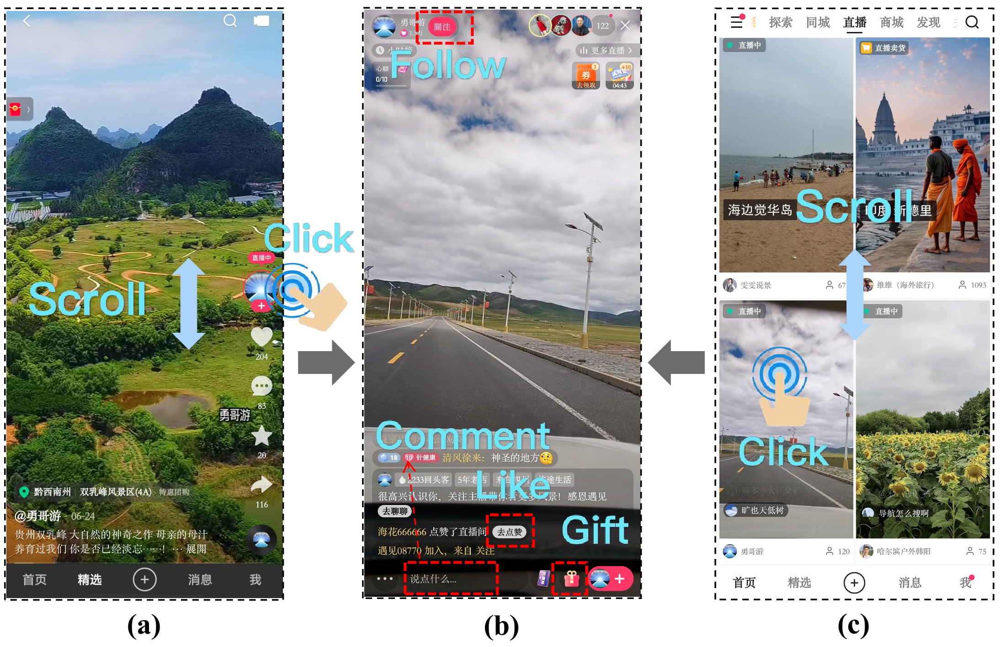

# KuaiLive

*KuaiLive* is a large-scale real-world dataset for live streaming recommendation collected from [Kuaishou](https://www.kuaishou.com/en), a leading live streaming platform in China with over 400 million daily active users. Notably, revenue from live streaming contributes approximately 30% of the company’s total income, highlighting its significant commercial potential.

**This is the first publicly available live streaming dataset that captures rich and realistic sequences of user interactions within an interactive app environment.**


## Overview

On Kuaishou, users can discover and enter live rooms of interest, where they interact with streamers in real time through behaviors such as clicking, liking, commenting, following, and sending virtual gifts. 


<p style="font-size:15px; text-align:left;">Figure: Illustration of live streaming scenarios in Kuaishou App. 
(a) The single-column recommendation feed, where users scroll vertically to receive a mix of short videos and live streams. 
(b) The live streaming interface, where users can interact with the streamer through actions such as Follow, Comment, Like, and Gift. 
(c) The two-column live streaming recommendation interface, where users scroll to browse live streams and click a thumbnail to enter a live room.</p>


### Advantages:

Compared with other existing datasets, KuaiLive has the following advantages:

- ✅ It includes the start and end timestamps of each live room, allowing researchers to simulate realistic recommendation settings where candidate items are temporally constrained and dynamically changing.
- ✅ It records multiple user behaviors (click, comment, like, gift), which can be leveraged to study multi-task learning and behavior modeling.
- ✅ It preserves the temporal order of each interaction, supporting fine-grained analysis of user behavior trajectories.
- ✅ It contains not only positive feedback but also negative feedback, making it suitable for Click-Through Rate (CTR) prediction.
- ✅ It provides not only user and item IDs, but also rich side information features, facilitating feature-aware modeling.
- ✅ It includes user watch time and gift price, enabling broader research tasks beyond recommendation, such as watch time and gift price prediction.


### Statistics

Here we show some basic statistics.
Check this page for more detailed [Descriptions](./detailed_statistics.html).

KuaiLive contains the real behavior of 23,772 users who engaged in all four types of interactions (click, comment, like and gift) on the Kuaishou app from May 5, 2025, to May 25, 2025. KuaiLive also provides both side information (e.g., gender, age, country) and fine-grained behavioral features (e.g., watch time, gift prices) to facilitate future research. 

Basic statistics of this dataset in the are summarized as follows:


**KuaiLive**

<style>
table {
  width: 80%;
  margin-left: auto;
  margin-right: auto;
}
</style>


| Dataset   | #Users  | #Streamers |  #Rooms    | #Interactions | #Clicks   | #Comments | #Likes   | #Gifts   |
|:---------:|:-------:|:----------:|:----------:|:-------------:|:---------:|:---------:|:--------:|:--------:|
| ourdata   | 23,772  | 452,621    | 11,613,708 | 5,357,998     | 4,909,515 | 196,526   | 179,311  | 72,646   |


The short descriptions for each feature filed are listed as below. Please refer to this [page](./detailed_statistics.html) for more details and examples.

| Feature Type       | Feature Descriptions |
|:------------------:|:--------------------:|
| **User feature**   | gender, age, country, device_brand, device_price, reg_timestamp, fans_num, follow_num, first_watch_live_timestamp, accu_watch_live_cnt, accu_watch_live_duration, is_live_author, is_video_author, and 7 encrypted vectors. |
| **Streamer feature** | gender, age, country, device_brand, device_price, reg_timestamp, live_operation_tag, fans_num, fans_group_num, follow_num, first_live_timestamp, accu_live_cnt, accu_live_duration, accu_play_cnt, accu_play_duration, and 7 encrypted vectors. |
| **Room feature**   | start_timestamp, end_timestamp, live_type, live_content_category, and live_name_representation. |

## Download the data:


KuaiLive has been shared at [https://zenodo.org/records/16565801](https://zenodo.org/records/16565801).

[](https://doi.org/10.5281/zenodo.16565801)

OPTION 1. Download via your browser:

You can download the dataset from this [link](https://zenodo.org/records/16565801).

OPTION 2: Download via the 'wget' command tool:

For the KuaiLive dataset:

```bash
wget https://zenodo.org/record/16565801/files/KuaiLive.zip
unzip KuaiLive.zip
```


## Citation

If you find our dataset useful, please cite the paper: ... 


[![CC BY-NC-SA 4.0][cc-by-nc-sa-shield]][cc-by-nc-sa]

This work is licensed under a
[Creative Commons Attribution-NonCommercial-ShareAlike 4.0 International License][cc-by-nc-sa].

[![CC BY-NC-SA 4.0][cc-by-nc-sa-image]][cc-by-nc-sa]

[cc-by-nc-sa]: http://creativecommons.org/licenses/by-nc-sa/4.0/
[cc-by-nc-sa-image]: https://licensebuttons.net/l/by-nc-sa/4.0/88x31.png
[cc-by-nc-sa-shield]: https://img.shields.io/badge/License-CC%20BY--NC--SA%204.0-lightgrey.svg


## Contact

If you have any questions, please feel free to contact us through [github issues](https://github.com/imgkkk574/KuaiLive/issues)
